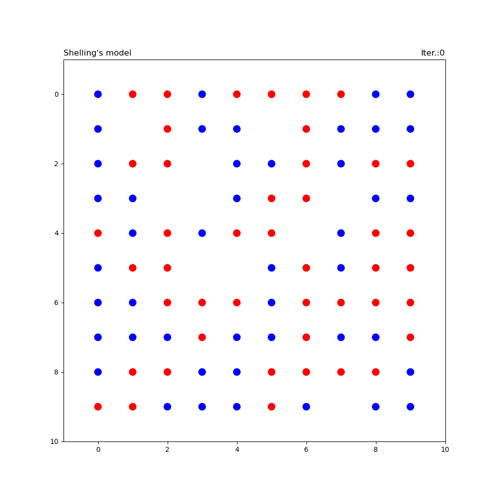

# Лабораторная работа 3 :walking:

# Постановка задачи:
- Реализовать модель Шеллинга
- Дан квадрат N*N в котором 45% клеток синие, 45% клеток красные, 10% клеток пустые. Начальное заполнение случайное
- Клетка счастлива, если у нее 2 или более соседей одного с ней цвета. Соседи -- это 8 клеток, вокруг данной

# Краткое инфо

Описание модели можно найти по ссылке https://en.wikipedia.org/wiki/Schelling%27s_model_of_segregation

Запуск по команде `python3 main.py --n N --fps F --path tmp --keep 0 --name movie`, где:
- `N` - ширина и высота поля
- `F` - fps в анимации. По умолчанию параметры равны 10 и 3 соответственно
- `path` - имя папки в которую сохраняются временные картинки, из которых создается гифка, по умолчанию `tmp`
- `keep` - оставлять ли временные картинки или нет. `1` - сохранять, `0` - не сохранять (по умолчанию) 
- `name` - имя которое присвоить гифке, по умолчанию `movie` 

Выходной файл в которм сохранены результаты работы в виле гиф файла - `movie.gif`

Весь код разделен на 3 модуля:
- `main.py` - из этого модуля происходит запуск всех написаных функций
- `utils.py` - здесь хранится утилитарная фунция для отрисовки поля
- `schelling.py`- основной модуль со всеми значимыми функциями

Необходимые библиотеки:

- ``matplotlib==3.3.2``
- ``jupyter==1.0.0``
- ``numpy==1.x.x``
- ``imageio==2.9.0``

# Результат

Результат представлен в гифке: 
